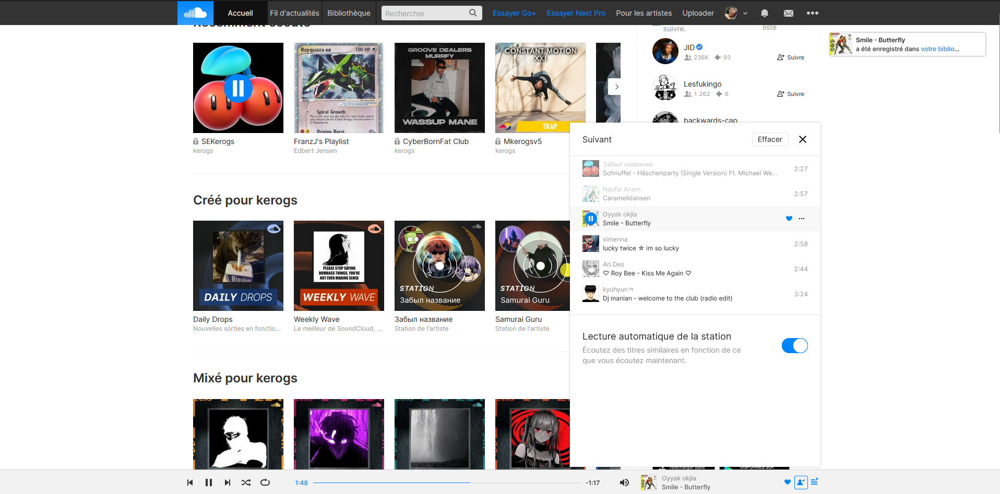
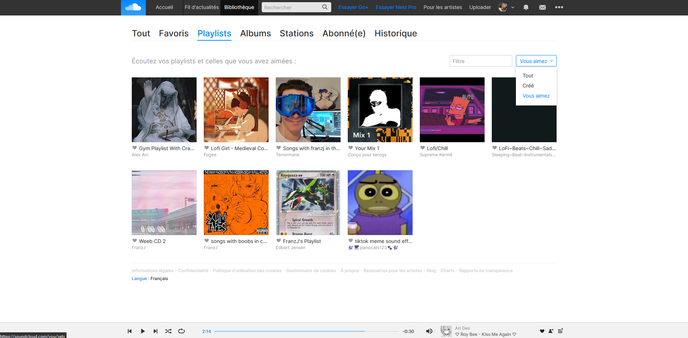

<div align="center">
    
    <h3>Soundcloud Blue</h3>
    <p><em>Changes soundcloud's primary color to blue.</em></p>
</div>

# Soundcloud Blue
license MIT

## Installation
1. Install the Stylus extension
2. Copy and paste the code located in ``/soundcloud-blue.css`` into Stylus.

## Preview
<div align="center">
<a href=".ksinf/previewHome.png"></a>
<a href=".ksinf/previewList.png"></a>
</div>

## Participation
Everyone can participate in improving the project. Simply make a pull request here indicating what you've done and it will be accepted. As long as you keep the color blue I shouldn't refuse your pull request. 

If you want to help, but don't know how, I'll keep an up-to-date TODO list.

### What you need to know
Soundclound uses SVG for these icons. There are 2 ways to change their color. 

#### SVG
Either the icon is in SVG, in which case you just need to do the following, for example:
```css
.playbackSoundBadge.m-queueVisible .playbackSoundBadge__queueIcon{
    fill:var(--primary);
}
```
#### Base64
Sometimes they are also in base64, so you will first need to take the following steps:
1. Convert [base64 to SVG](https://base64.guru/converter/decode/image) with a website
2. Change the color in the SVG code located in ``fill``.
```svg
<?xml version="1.0" encoding="UTF-8"?>
<svg xmlns="http://www.w3.org/2000/svg" width="14" height="14" viewBox="0 0 14 14">
  <path fill="#0085ff" fill-rule="evenodd" d="..."/>
</svg>
```
3. Convert [SVG to Base64](https://base64.guru/converter/encode/image/svg) with a website
> [!WARNING]
> Remember to add the DATA URI in front of the base64 (if the site does not do so) : ``image/svg+xml;base64,``
4. Paste the new base64 code into the CSS
```css
.sc-button-small.sc-button-selected.sc-button-like::before,
.sc-button-small.sc-button-selected.sc-button-like.sc-button-lightfg::before{
    background-image:url(data:image/svg+xml;base64,/* base64 here */);
}
```
## TODO
- [ ] Repairing the forgotten
- [ ] Make a dark blue theme
- [ ] Change the color of the Canva
- [ ] ...

## License
This mini-project is under [MIT license](LICENSE).